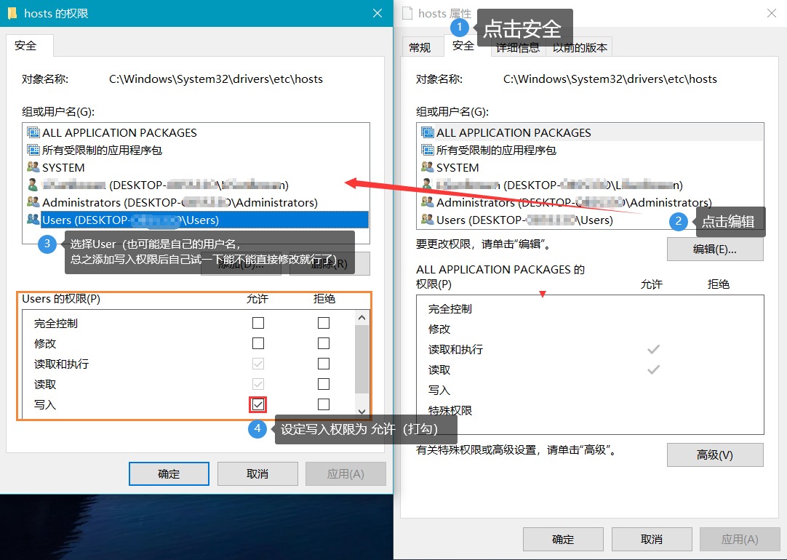
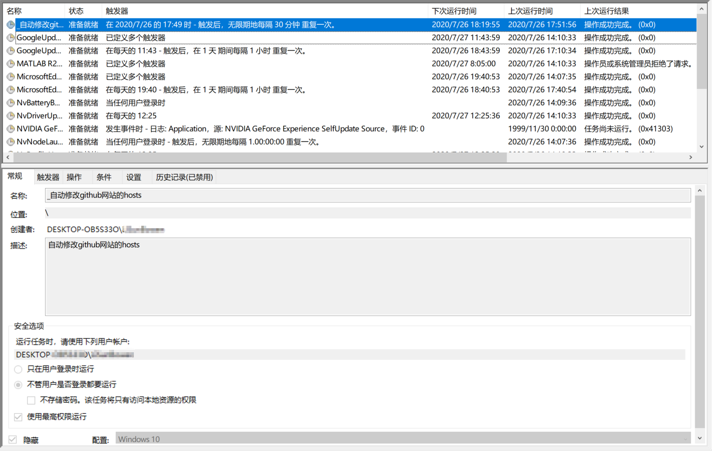

# 全自动更新查改 GitHub Hosts

## 运行环境
1. 需要```Python 3.0 ```以上版本以及```requests```库，您可以执行以下命令进行安装：
	```
	pip install requests
	```
2. 或者执行以下命令
	```
	pip install -r requirements.txt
	```

## 该方法的基本思路：
1. 利用爬虫对GitHub各个ip地址进行更新并且在hosts文件中更新
2. 利用Windows的计划任务实现每小时自动运行一次脚本

## 具体步骤：
1. Python自动查改hosts的脚本已经写好，即```自动查改ip地址.py```，需要下载到自己的电脑中
2. 修改hosts需要管理员权限，方法如图：

	

3. 设定计划任务，一般情况只能每天运行一次，每小时运行一次的方法参考CSDN链接：[利用windows计划任务实现每小时甚至每分钟运行一次你的Python代码](https://blog.csdn.net/kangxiaoyanl/article/details/104444534)，修改完毕后效果如图:

	

## 注意：
1. 在运行程序前，您务必在自己的hosts文件末尾添加如下内容，或者直接用仓库中的hosts替换您的hosts，***因为程序会根据```# GitHub Host Start```和```# GitHub Host End```文本进行定位***：
	```
	# GitHub Host Start
	183.131.184.76                github.githubassets.com
	199.232.68.133                camo.githubusercontent.com
	199.232.68.133                github.map.fastly.net
	199.232.69.194                github.global.ssl.fastly.net
	140.82.112.3                  github.com
	140.82.112.6                  api.github.com
	199.232.68.133                raw.githubusercontent.com
	199.232.68.133                user-images.githubusercontent.com
	199.232.68.133                favicons.githubusercontent.com
	199.232.68.133                avatars5.githubusercontent.com
	199.232.68.133                avatars4.githubusercontent.com
	199.232.68.133                avatars3.githubusercontent.com
	199.232.68.133                avatars2.githubusercontent.com
	199.232.68.133                avatars1.githubusercontent.com
	199.232.68.133                avatars0.githubusercontent.com
	140.82.114.4                  gist.github.com
	
	# GitHub Host End
	```
2. 给予程序hosts写入权限有一定的风险，如果电脑中存在木马程序，很容易对hosts文件进行修改

## 声明
本项目在程序设计上借鉴了[GitHub520项目](https://github.com/521xueweihan/GitHub520)
